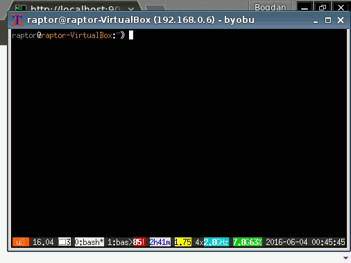

# no-vnc Docker Image

This container exports a connection to a VNC server using no-vnc. This is useful to connect to otherwise innaccesible containers, without the use of another client except the browser.

## Usage

```sh
docker run \
    -it \
    -p 8081:8081 \
    --link containerthatrunsvnc:vnc \
    bmst/no-vnc
```

## Demo

Here's a sample on how to inspect a running [Germanium](http://germaniumhq.com) webdriver browser integration test:



